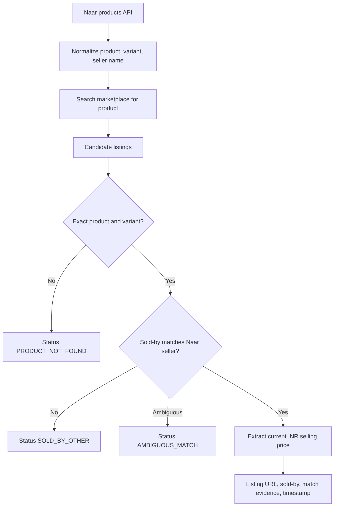

# Naar Marketplace Price-Matching Brief

**Status:** proposal for review · **Scope of this round:** solution design only, no build · **Region:** India

## 1. Problem and scope

For each active Naar product, find the *same seller* selling the *same product* on Amazon India, Flipkart, and Meesho, and record the comparable current selling price in INR against Naar's own price.

A result is only recorded when **both** are verified:

1. the marketplace listing belongs to the same seller as the Naar product, and
2. the listing is the exact same product and variant.

**In scope**
- Pull active products from Naar's products API (India region).
- Identify the same seller's presence on each marketplace, then locate that seller's exact product.
- Record the marketplace selling price alongside the Naar selling price, with evidence.

> **Key constraint (confirmed):** Naar does **not** have marketplace store URLs or seller IDs for Amazon, Flipkart, or Meesho. Marketplace seller identity therefore has to be *established and confirmed* from available signals — not looked up from a provided mapping. This is the central hard problem of this brief (Section 4).

**Not in scope this round**
- Building a production application, dashboard, alerts, or notifications.
- Automated rollout, scheduling, or scanning the full catalog.
- Any commitment to a specific scraping vendor before the POC validates the approach.

**Deliverable now:** this brief. A 10-product proof-of-concept (Section 7) is a separately approved follow-up.

> Note: this repository already contains an earlier, broader experiment (regex marketplace parsers, a fuzzy matcher, a dashboard). Those are prior attempts, not evidence that exact seller-and-product matching is solved. This brief deliberately narrows to the problem as stated on the call.

---

## 2. Naar input contract

**Endpoint (confirmed):**

```
GET https://prodapi-commerce.naar.io/v1/products?status=active&limit={limit}&skip={skip}
```

Pagination is `limit` + `skip`. The POC uses `limit=10&skip=0`.

**Fields we rely on** (observed in a live sample of 10 products):

| Field | Use |
|-------|-----|
| `_id` | Naar product identifier |
| `title` | Product name; primary search seed |
| `description` | Secondary evidence (pack size, weight, material, "Country of Origin") |
| `currency` | Always `INR` in sample; comparison is India-only |
| `sellerId` | Naar's internal seller identity; the anchor we must *link* to a marketplace seller (Section 4) |
| `seller.storeName`, `seller.businessName` | The strongest seller-identity signals we have (e.g. `TREASURE FLAVOURS`, `Kaithari Kalanjiyam`); used to find the seller on each marketplace |
| `variants[]` | Per-variant price and attributes; a product can have multiple variants |
| `variants[].sellingPrice` | **The Naar comparison price (INR).** |
| `variants[].price`, `priceWithoutTax`, `originalPriceWithTax` | Kept as source evidence, never coalesced into the comparison price |
| `variants[].attributes`, `variantName`, `variantOption` | Variant identity (e.g. size S, 250g) for the product gate |

**Price semantics.** The Naar side of every comparison is the variant `sellingPrice` in INR. `price`, `priceWithoutTax`, and `originalPriceWithTax` are retained as evidence but are never silently substituted or averaged into the comparison value — mixing tax bases or MRP-vs-selling is a known way to produce misleading deltas.

**Observed data caveats** (from the sample, worth stating up front):
- Some variants carry a `discount` block; the effective `sellingPrice` can already reflect it (e.g. one product showed `sellingPrice` 211.47 against `priceWithoutTax` 399). Use `sellingPrice` as-is and record the raw fields as evidence.
- `hsnCode`/`hsnData` descriptions are unreliable as product identifiers (one saree row carried an HSN description about copper scrap). Do not use HSN text for matching.
- The sample exposes **no** GTIN/EAN/barcode and **no** marketplace store URL or marketplace seller ID. Both are absent, so both must be handled by the matching logic (see Section 4).
- Where present, `seller.businessName` is the **legal entity name** (e.g. `PORTRAITXAI LLP`, `NITHYA VINOTH KUMAR`) and `seller.storeName` is the **brand/store name** (e.g. `YugaVeera`, `VIN Marketing Mittai Shop`). Marketplaces display a "Sold by" seller name that we can compare against these.

**Seller-identity inputs Naar can realistically provide.** Since marketplace store URLs do not exist on the Naar side, the useful upstream inputs are anything that strengthens *seller* confirmation:
- legal business name and GSTIN (to match a marketplace "Sold by" name / tax details),
- any known brand name(s) the seller trades under,
- optionally, a seller-confirmed marketplace store name if the seller volunteers it.

These are confirmation signals, not an authoritative ID. Marketplace seller identity is inferred and scored, never assumed (Section 4).

---

## 3. Marketplace acquisition approaches

Three options, compared for a small-team, India-only effort:

| Approach | Strengths | Weaknesses |
|----------|-----------|------------|
| **1. Official marketplace / partner APIs** | Most stable and compliant; structured price and seller fields | Access approval is slow; seller-scoped product search may be limited or unavailable |
| **2. Managed extraction / search provider** (paid) | Fastest practical path for a POC; handles rendering/anti-bot; less ops burden | Paid; parser output must still be validated; provider coverage varies by marketplace |
| **3. Direct browser / HTML scraping** | No third-party cost; full control | High maintenance (markup churn), blocking/anti-bot, and terms-of-service risk |

**Recommendation.** One adapter per marketplace behind a common interface. Prefer an official API where access exists; use a managed extraction provider for the POC where it does not; keep direct scraping only as a controlled, per-marketplace fallback. Each adapter must return, per candidate listing, the concrete purchasable price **and** the listing's "Sold by" seller string — the latter is what makes seller confirmation possible at all (Section 4).

**Explicitly rejected:** homepage-wide "first ₹ value" grabs, generic search-result placeholders, and query-string-as-title fallbacks. These produce confident-but-wrong data and are the main failure mode of the earlier experiment.

---

## 4. Matching flow: product and seller confirmed together

Without a marketplace store URL, we cannot start from "this seller's catalog". Instead we search each marketplace for the product, then confirm on each candidate listing that (a) it is the exact product/variant **and** (b) it is sold by the same seller. Both gates must pass; the order is just search-efficiency.



**Product gate.** Among search candidates:
- Prefer stable identifiers when a marketplace exposes them (GTIN/EAN/UPC on the listing).
- Otherwise require strong corroborating evidence across brand/title, pack size, weight, colour, size, and the Naar variant attributes.
- Fuzzy title similarity may *rank* candidates but never *proves* a match on its own.

**Seller gate (the hard part, since no store URL exists).** On each product-matched listing, read the marketplace's "Sold by" / seller field and compare it to Naar's `seller.storeName` / `seller.businessName` (and GSTIN if the marketplace exposes it):
- **Strong match** — sold-by name (or GSTIN) clearly equals the Naar seller → `MATCHED`.
- **No match** — sold-by is clearly a different seller → `SOLD_BY_OTHER` (a real signal: the product exists on the marketplace but from someone else).
- **Weak/absent** — the marketplace hides the seller, uses a fulfilment brand (e.g. generic retail), or the name is too generic to be sure → `AMBIGUOUS_MATCH`, never upgraded to `MATCHED`.

Every accepted match stores the exact sold-by string and which signals agreed, so a human can audit it. Because seller identity is inferred from names rather than an authoritative ID, `MATCHED` rows carry a confidence and are subject to the POC's manual verification (Section 7).

**Price gate.** Capture the current purchasable selling price in INR. Exclude struck-through MRP, coupon-only prices, EMI per-month figures, delivery fees, and out-of-stock offers. Preserve MRP separately as evidence when shown.

---

## 5. Role of genAI

genAI is used, but in a deliberately narrow role: it assists **matching and normalization**, and is kept away from the two outputs it would corrupt — the price and the final seller verdict.

**Where genAI helps:**

- **Product matching (primary use).** The same product reads differently per platform (Naar `Amla Powder` vs. `Organic Indian Gooseberry (Amla) Powder 100g`). Embeddings for first-pass candidate ranking, and an LLM "same product/variant?" judge for borderline pairs, handle synonyms and phrasing that plain fuzzy string matching (the earlier Fuse.js approach) misses.
- **Attribute extraction.** An LLM pulls pack size, weight, colour, and variant out of Naar's free-text `title`/`description` into structured fields so the product gate compares like-for-like.
- **Seller-name reasoning.** Judging whether a listing's "Sold by" string corresponds to Naar's `storeName` / `businessName` — fuzzy entity resolution that LLMs do well.
- **Search-query construction** from a messy Naar title.

**Where genAI is deliberately not used:**

- **Never for the price.** The marketplace price comes from deterministic parsing of structured data (API / JSON-LD), never an LLM reading a page. A hallucinated number is the most damaging possible output here.
- **Never as the seller proof.** genAI may *propose* a seller match with a calibrated confidence and the evidence it used, but it cannot manufacture certainty we do not have. Anything below threshold is `AMBIGUOUS_MATCH` for human review. This is the direct fix for the earlier build's failure mode of fabricating confidence.
- **Not for fetching / anti-bot** — that is the adapter layer.

**Boundary rule:** genAI outputs a structured verdict (`same_product`, `confidence`, `fields_that_agreed`) that gates a match; it never emits a price and never single-handedly asserts an unverifiable seller identity. Cost is trivial at POC scale (10 products); at full-catalog scale, embeddings do first-pass ranking and an LLM is reserved for borderline pairs.

---

## 6. Outputs and failure states

One record per **Naar variant × marketplace**:

| Field | Notes |
|-------|-------|
| `naar_product_id`, `naar_variant_id` | From the Naar API |
| `naar_seller_id` | From the Naar API |
| `marketplace` | `amazon_in` / `flipkart` / `meesho` |
| `marketplace_sold_by` | The listing's "Sold by" string as observed (there is no marketplace seller ID from Naar) |
| `listing_id`, `listing_url` | For product-matched candidates |
| `naar_selling_price` | Variant `sellingPrice`, INR |
| `marketplace_selling_price` | INR; present only for `MATCHED` |
| `currency` | `INR` |
| `observed_at` | Timestamp of capture |
| `product_match_method`, `seller_match_signal`, `match_evidence` | e.g. `attribute_gate`; `sold_by_name` / `gstin`; fields that agreed |
| `confidence` | Seller-identity confidence (names are inferred, not authoritative) |
| `status` | See below |

**Statuses:** `MATCHED`, `SOLD_BY_OTHER`, `PRODUCT_NOT_FOUND`, `AMBIGUOUS_MATCH`, `OUT_OF_STOCK`, `SOURCE_ERROR`.

Only `MATCHED` rows carry a marketplace price. Unavailable, ambiguous, and failed results are recorded honestly with their status — never as a zero price or a guessed value. The taxonomy keeps three genuinely different outcomes distinct: the exact product isn't on the marketplace (`PRODUCT_NOT_FOUND`), it's there but sold by someone else (`SOLD_BY_OTHER`), the seller can't be confirmed (`AMBIGUOUS_MATCH`), and a scrape/API failure (`SOURCE_ERROR`).

---

## 7. Future 10-product POC (separately approved)

**Selection.** 10 active Naar products spanning multiple sellers and product types, prioritising sellers likely to also sell on at least one target marketplace.

**Method.**
1. Establish a small manual ground-truth sheet first (correct seller, product, variant, and displayed price per marketplace), including the actual "Sold by" name seen on each listing.
2. Run the adapters for all three marketplaces against the product-and-seller flow in Section 4.
3. Retain evidence: listing URLs (or screenshots), the sold-by string, and timestamps for every recorded price.

**Success criteria — precision over coverage:**
- Zero `MATCHED` rows where the sold-by seller is actually someone other than the Naar seller.
- Every recorded marketplace price is manually reproducible from its evidence.
- Every miss is classified with an honest status (including `SOLD_BY_OTHER` vs `PRODUCT_NOT_FOUND`).
- Match coverage is reported **per platform**, not blended.

**The POC's real question.** Can we confirm marketplace seller identity reliably enough from names/GSTIN alone, given there is no store URL? The POC measures how often the sold-by signal is strong, wrong, or ambiguous — that result drives the go/no-go.

**Open dependencies / go-no-go inputs:**
- Seller-confirmation signals from Naar: legal business name, GSTIN, known brand names.
- How often each marketplace actually exposes a usable "Sold by" name (Meesho in particular often does not).
- Availability of stable product identifiers (GTIN/EAN) on marketplace listings.
- Marketplace API access, or an agreed managed-extraction/scraping route and its compliance posture.
- POC precision and per-platform coverage results.
