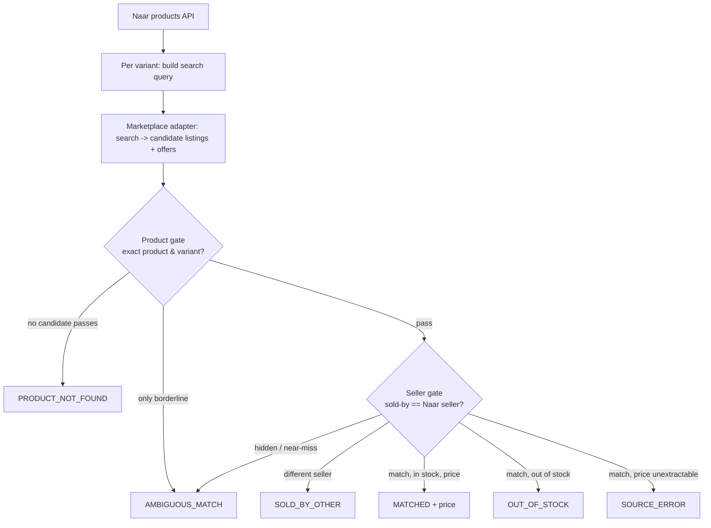

# Naar marketplace price-matching — POC

Proof-of-concept for the price-matching brief: for each active Naar product, find
the *same seller* selling the *same product/variant* on Amazon India, Flipkart,
and Meesho, and record the comparable INR price — **only** when both the product
gate and the seller gate pass. Every row carries an honest status; a marketplace
price is written only on `MATCHED` rows, from structured offer data, never a guess.

---

## Quick start

### Prerequisites
- **Python 3.9+**
- Offline commands (`--self-test`, `--backend fixture`, `eval_accuracy.py`,
  `prove_llm.py`) need **no dependencies and no network** — stdlib only.
- Live/`direct` runs need: `pip install requests beautifulsoup4`
- Selenium fetch backend also needs: `pip install selenium undetected-chromedriver`
  and a local **Google Chrome**.
- Borderline judge (optional) needs `requests` + an API key (see below).

```bash
pip install requests beautifulsoup4 selenium undetected-chromedriver
```

### Run it — offline (no keys, no network)
```bash
python poc/naar_price_poc.py --self-test         # unit regressions (24 checks)
python poc/naar_price_poc.py --backend fixture   # synthetic demo, exercises all six statuses
python poc/eval_accuracy.py                       # matcher accuracy report (labeled set)
python poc/prove_llm.py                           # provider-agnostic judge proof (mock server)
```

### Run it — live
Defaults to **Amazon + Flipkart**, fetched free via headless Chrome:
```bash
USE_SELENIUM=1 python poc/naar_price_poc.py --backend direct --limit 10
```
With the borderline LLM judge (resolves uncertain product matches):
```bash
USE_SELENIUM=1 ANTHROPIC_API_KEY=sk-... \
  python poc/naar_price_poc.py --backend direct --limit 10 --llm-judge
```
Add Meesho (needs a managed provider — it's behind Akamai):
```bash
SCRAPERAPI_KEY=... python poc/naar_price_poc.py --backend direct --limit 10 \
  --marketplaces amazon_in flipkart meesho
```

### CLI flags
| Flag | Default | Meaning |
|------|---------|---------|
| `--backend fixture\|direct` | `fixture` | `fixture` = offline synthetic data; `direct` = live Naar API + marketplaces |
| `--limit` / `--skip` | `10` / `0` | Naar product pagination |
| `--marketplaces` | `amazon_in flipkart` | subset of `amazon_in flipkart meesho` |
| `--llm-judge` | off | use an LLM to adjudicate *borderline* product pairs |
| `--strict` | off | any unexplained candidate token demotes to borderline |
| `--self-test` | — | run regression checks and exit |
| `--out` | `poc_out` | output directory |

---

## How it works

The core problem: Naar has **no** marketplace store URL or seller ID, so we can't
start from "this seller's catalog". Instead we search each marketplace for the
product, then **confirm two things independently** on each candidate listing —
that it's the exact product/variant, *and* that it's sold by the same seller.
Both gates must pass before a price is recorded.



**1 · Input (`fetch_naar_products`, `iter_variants`).** Pull active products from
the Naar products API, one row **per variant**. The Naar comparison price is the
variant's `sellingPrice` (INR) — `price` / `priceWithoutTax` / MRP are kept as
evidence but never coalesced into it. The seller identity we must confirm is the
product's `seller.storeName` (brand) and `seller.businessName` (legal entity).

**2 · Search (`MarketplaceAdapter.search`).** One adapter per marketplace builds a
query from the product title + variant signals and returns `Candidate` listings,
each carrying its `Offer`s (the `Sold by` name and the purchasable price).
Extraction is **structured only** — JSON-LD, Flipkart `__INITIAL_STATE__`, Meesho
`__NEXT_DATA__` — never a regex-first-price grab.

**3 · Product gate (`product_gate`).** Per candidate → `pass` / `fail` / `borderline`:
- **Quantity & pack** must agree **symmetrically** — a weight or "pack of N" stated
  on either side that the other lacks or contradicts blocks an auto-pass (a single
  unit vs a multipack → `borderline`/`fail`, so a large price delta can't hide a
  pack mismatch).
- **Variant attributes** (colour, numeric size) must appear as whole words in the
  title (`Teal` ≠ inside `Steal`; `8` ≠ inside `18`).
- **Coverage vs unexplained ratio** — how much of the Naar identity the listing
  contains, and how much of the listing Naar can't explain. A derivative
  (`Amla Powder Hair Mask` vs `Amla Powder`) is dominated by unexplained tokens →
  `borderline`, never an auto-pass. Fuzzy similarity only *ranks*; it never *proves*.
- Optional **LLM judge** adjudicates only the borderlines (never sets price/seller).

**4 · Seller gate (`seller_gate`) — confirm the seller even under a *different* name.**
A seller can rebrand freely, but their tax id, registered legal name, and onboarded
store URL don't change. The gate resolves identity in tiers, hardest signal first:

| Tier | Signal | Verdict |
|------|--------|---------|
| 1 | **GSTIN** exact (unique govt tax id) | `MATCH` — same GSTIN ⇒ same seller, any brand name; different GSTIN ⇒ `OTHER` |
| 2 | **Seller-provided store URL** == the listing's seller link | `MATCH` |
| 3 | Registered **legal name** exact / token-set (`PVT LTD`==`PRIVATE LIMITED`, reordering) | `MATCH` |
| 4 | Name **similarity** only | `AMBIGUOUS` proposal — never upgraded |

Only tiers 1–3 (hard identifiers) become a `MATCH`; soft name similarity stays
`AMBIGUOUS` for review — so **recall on renamed sellers goes up without faking a
match**. Two inputs feed this:

- **Onboarding map — the reliable source.** `poc/seller_identity.json` (see
  `seller_identity.example.json`, gitignored): per-seller `gstin` / `businessName` /
  `brand` / `pincode` / `<marketplace>_url`. **Naar already holds this** in its seller
  onboarding / KYC records (every seller provided GSTIN + legal entity to sell on
  Naar), so this is a database export, not a manual lookup. Merged via
  `resolve_naar_seller()`.
- **Marketplace seller-profile scrape — best-effort only.** `SELLER_PROFILE_LOOKUP=1`
  makes the Amazon adapter capture the seller-profile link and try to read the legal
  name + GSTIN. In practice **Amazon gates the seller-info page** (it 404s on direct
  access and hides GST behind interaction), so treat this as opportunistic — a miss
  just leaves the row `AMBIGUOUS`. **Don't rely on it; drive matching from the
  onboarding map above.**

**5 · Decision → status.** Verdicts are collected across **all** matched
candidates/offers, then one status is chosen (see legend below). The cheapest
in-stock offer from the matched seller wins a `MATCHED`.

**Price integrity (the cardinal rule).** A marketplace price is recorded **only**
on `MATCHED`, and only from the matched seller's structured offer — never a guessed
price, a homepage/catalogue-minimum figure, or a query-as-title self-match. A
variant with no `sellingPrice` is skipped, never recorded as ₹0.

### Status legend
| Status | Meaning |
|--------|---------|
| `MATCHED` | same product **and** same seller, in stock — real price + Δ recorded |
| `SOLD_BY_OTHER` | product found, but every identifiable offer is a different seller |
| `AMBIGUOUS_MATCH` | product only borderline, or seller hidden / near-miss — not confident |
| `PRODUCT_NOT_FOUND` | no candidate is the same product |
| `OUT_OF_STOCK` | same seller + product, but not purchasable |
| `SOURCE_ERROR` | fetch/parse failed, or seller matched but price couldn't be extracted |

---

## Fetch backends

`_http_get` picks a backend in this order:

1. **Selenium** — `USE_SELENIUM=1`. A real headless Chrome (undetected-chromedriver
   when available) that renders JS and evades basic bot checks. **No per-request
   cost** — the free alternative to ScraperAPI. Rebuilds a dead browser session
   once, and treats a redirect to a sign-in/captcha/error page as an honest block.
2. **ScraperAPI** — `SCRAPERAPI_KEY` set (used for meesho.com, or every host with
   `SCRAPERAPI_ALL=1`).
3. **Plain requests** — default; fine only for non-bot-walled pages.

**Measured (live, headless Selenium, no ScraperAPI):**

| Marketplace | Result |
|-------------|--------|
| Amazon.in | ✅ full search page, ~60 product cards |
| Flipkart | ✅ full search page, `/p/` links + JSON-LD |
| Meesho | ⛔ Akamai **Access Denied** — needs a residential proxy or ScraperAPI |

Fetching is only half the job: a low *match* rate is the gate being deliberately
strict (correctness over coverage), not a fetch problem — expect **high precision,
lower recall** regardless of backend. In a live 15-product sample, matches came
only from a seller who genuinely also sells on Amazon; the rest were honestly
`PRODUCT_NOT_FOUND` / `SOLD_BY_OTHER`.

---

## Borderline LLM judge (optional)

Rules only on product-gate *borderlines* — never sets a price or seller, returns
`None` on any failure (gate stays honestly borderline). Listing text is treated as
untrusted data (prompt-injection-resistant).

`LLM_JUDGE_PROVIDER=anthropic|openai` (default: auto by whichever key is set).
`openai` drives **any** OpenAI-compatible vendor via `OPENAI_BASE_URL` (OpenAI /
Qwen / DeepSeek / Groq / OpenRouter / local Ollama).

---

## Environment variables

| Var | Default | Purpose |
|-----|---------|---------|
| `USE_SELENIUM` | off | route fetches through headless Chrome (free) |
| `SELENIUM_HEADFUL` | off | show the browser window (often bypasses more walls) |
| `SELENIUM_WAIT_MS` | `4000` | JS settle time per page |
| `SELENIUM_UC` | `1` | prefer undetected-chromedriver (`0` = stock Selenium) |
| `SCRAPERAPI_KEY` | — | managed scraper; required for Meesho |
| `SCRAPERAPI_ALL` | off | route every host through ScraperAPI |
| `SCRAPERAPI_RENDER` | off | JS render on the ScraperAPI path |
| `LLM_JUDGE_PROVIDER` | auto | `anthropic` \| `openai` |
| `ANTHROPIC_API_KEY` / `ANTHROPIC_MODEL` | — / `claude-haiku-4-5` | Anthropic judge |
| `OPENAI_API_KEY` / `OPENAI_BASE_URL` / `OPENAI_MODEL` | — / `https://api.openai.com/v1` / `gpt-4o-mini` | OpenAI-compatible judge |
| `SELLER_PROFILE_LOOKUP` | off | fetch the marketplace seller-profile page to read legal name + GSTIN (confirms renamed sellers) |
| `NAAR_API_KEY` | — | optional `X-Api-Key` for the Naar API |
| `MATCH_COVERAGE_FAIL` / `MATCH_COVERAGE_PASS` / `MATCH_MAX_UNEXPLAINED_RATIO` | `0.35` / `0.6` / `0.45` | product-gate tuning knobs |

---

## Outputs

A run writes to `--out` (default `poc_out/`):
- **`results.csv`** and **`results.jsonl`** — one record per **variant × marketplace**,
  with the Naar price, the marketplace price (only on `MATCHED`), sold-by / legal
  name, listing URL, match method + evidence, confidence, and timestamp.
- A **per-platform status split** is printed to stdout.

---

## Files

| File | What it is |
|------|-----------|
| `naar_price_poc.py` | The POC — Naar API pull, per-marketplace adapters, product + seller gates, six honest statuses, fetch backends, optional judge. Ships `--self-test`. |
| `eval_accuracy.py` | Labeled accuracy harness over the matcher (offline). Reports status accuracy + the cardinal metric: **MATCHED precision / zero false matches**. |
| `prove_llm.py` | End-to-end proof of the provider-agnostic judge against a local mock OpenAI-compatible server (no secrets, no network). |
| `live_judge.py` | Live smoke test of the judge against a real vendor; provider/keys from env, prints only verdicts. |
| `seller_identity.example.json` | Template for the per-seller onboarding map (`gstin` / legal name / store URLs) that confirms a seller under a different marketplace name. Copy to `seller_identity.json` (gitignored). |

---

## Scope & caveats

- Accuracy proven here is **matching-logic** precision on a labeled set + a small
  live sample — not full end-to-end real-marketplace accuracy at scale.
- Direct scraping of Amazon/Flipkart/Meesho carries **ToS/legal** considerations;
  Meesho specifically is behind Akamai and needs a compliant managed provider.
- Match rate is bounded by **seller presence** — if Naar's seller isn't on the
  marketplace under the same identity, no correct `MATCHED` exists, and the tool
  says so (`SOLD_BY_OTHER` / `AMBIGUOUS`) rather than inventing one.
