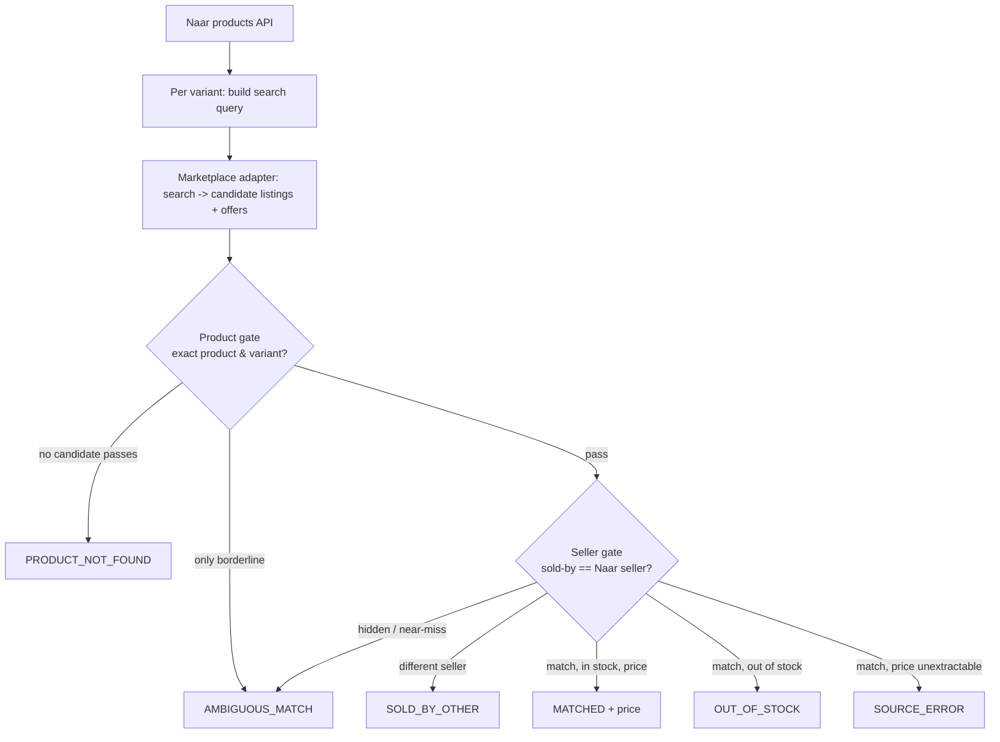

# Naar marketplace price-matching — POC

Proof-of-concept for the price-matching brief: for each active Naar product,
find the *same seller* selling the *same product/variant* on Amazon India,
Flipkart, and Meesho, and record the comparable INR price — only when both the
product gate and the seller gate pass. Every row carries an honest status; a
marketplace price is written **only** on `MATCHED` rows, from structured offer
data, never a guess.

## How it works

The core problem: Naar has **no** marketplace store URL or seller ID, so we can't
start from "this seller's catalog". Instead we search each marketplace for the
product, then **confirm two things independently** on each candidate listing —
that it's the exact product/variant, *and* that it's sold by the same seller.
Both gates must pass before a price is recorded.



**1 · Input (`fetch_naar_products`, `iter_variants`).** Pull active products from
the Naar products API, one row **per variant**. The Naar comparison price is the
variant's `sellingPrice` (INR) — `price` / `priceWithoutTax` / MRP are kept as
evidence but never coalesced into it. The seller identity we must confirm is the
product's `seller.storeName` (brand) and `seller.businessName` (legal entity).

**2 · Search (`MarketplaceAdapter.search`).** One adapter per marketplace
(Amazon.in, Flipkart, Meesho) builds a query from the product title + variant
signals and returns `Candidate` listings, each carrying its `Offer`s (the
`Sold by` name and the purchasable price). Extraction is **structured only** —
JSON-LD, Flipkart `__INITIAL_STATE__`, Meesho `__NEXT_DATA__` — never a
regex-first-price grab. Meesho / blocked hosts go through ScraperAPI when
`SCRAPERAPI_KEY` is set.

**3 · Product gate (`product_gate`).** Per candidate, returns `pass` / `fail` /
`borderline`:
- **Quantity** must agree when Naar states one (100g vs 250g → `fail`).
- **Variant attributes** (colour, numeric size) must appear as whole words in the
  listing title (`Teal` must not match inside `Steal`; `8` must not match inside
  `18`).
- **Coverage vs unexplained ratio** — how much of the Naar identity the listing
  contains, and how much of the listing is content Naar can't explain. A
  derivative (`Amla Powder Hair Mask` vs `Amla Powder`) is dominated by
  unexplained tokens → `borderline`, never an auto-pass. Fuzzy similarity only
  *ranks* candidates; it never *proves* a match. HSN text is never used.

**4 · Seller gate (`seller_gate`).** Per offer on a product-matched listing,
compares the marketplace `Sold by` (and registered legal name, when available)
against Naar's store + business names, after stripping only true legal suffixes
(`PVT LTD` == `PRIVATE LIMITED`; word reordering handled by token-set equality).
Only **exactness** is a `MATCH`; similarity in `[0.75, 1.0)` is an `AMBIGUOUS`
proposal (never upgraded to a match); an identifiable different name is `OTHER`;
a hidden seller is `AMBIGUOUS`.

**5 · Decision → status.** Verdicts are collected across **all** matched
candidates/offers, then one status is chosen:
`MATCHED` (both gates pass, in stock, price present — cheapest matched offer wins)
· `OUT_OF_STOCK` · `SOURCE_ERROR` (seller matched but price unextractable, or an
offer fetch failed) · `SOLD_BY_OTHER` · `AMBIGUOUS_MATCH` · `PRODUCT_NOT_FOUND`.

**Price integrity (the cardinal rule).** A marketplace price is recorded **only**
on `MATCHED`, and only from the matched seller's structured offer. Never a
guessed price, a homepage/catalogue-minimum figure, or a query-as-title
self-match. A variant with no `sellingPrice` is skipped, never recorded as ₹0.

## Files

| File | What it is |
|------|-----------|
| `naar_price_poc.py` | The POC. Naar API pull, per-marketplace adapters, product + seller gates, six honest statuses (`MATCHED`, `SOLD_BY_OTHER`, `PRODUCT_NOT_FOUND`, `AMBIGUOUS_MATCH`, `OUT_OF_STOCK`, `SOURCE_ERROR`). Ships its own `--self-test`. |
| `eval_accuracy.py` | Labeled accuracy harness over the matcher (offline, deterministic). Reports status accuracy + the cardinal metric: **MATCHED precision / zero false matches**. |
| `prove_llm.py` | End-to-end proof of the provider-agnostic borderline judge against a local mock OpenAI-compatible server (no secrets, no network). |
| `live_judge.py` | Live smoke test of the judge against a real vendor. Provider/keys come from env; prints only verdicts. |

## Run

```bash
python poc/naar_price_poc.py --self-test              # unit regressions (offline)
python poc/naar_price_poc.py --backend fixture        # offline demo, all six statuses
python poc/eval_accuracy.py                           # matcher accuracy report
python poc/prove_llm.py                               # mock-server judge proof
python poc/naar_price_poc.py --backend direct --limit 10   # live run (needs SCRAPERAPI_KEY / access)
```

Direct-fetch marketplaces need network access and commonly bot-block. Blocks
surface as `SOURCE_ERROR`, never a silent `PRODUCT_NOT_FOUND`.

**Default marketplaces: `amazon_in` + `flipkart`** — the two Selenium fetches for
free. Meesho sits behind Akamai (Access Denied to headless) and needs a managed
provider / proxy, so it's **opt-in**:
`--marketplaces amazon_in flipkart meesho` with `SCRAPERAPI_KEY` set.

### Fetch backends

`_http_get` picks a backend in this order:

1. **Selenium** — `USE_SELENIUM=1`. A real headless Chrome (undetected-chromedriver
   when available) that renders JS and evades basic bot checks. **No per-request
   cost** — the free alternative to ScraperAPI.
   ```bash
   USE_SELENIUM=1 python poc/naar_price_poc.py --backend direct --limit 10
   ```
   Knobs: `SELENIUM_HEADFUL=1` (show the window; bypasses more walls),
   `SELENIUM_WAIT_MS=4000` (JS settle time), `SELENIUM_UC=0` (force stock Selenium).
2. **ScraperAPI** — `SCRAPERAPI_KEY` set (used for meesho.com, or all hosts with
   `SCRAPERAPI_ALL=1`).
3. **Plain requests** — default; fine only for non-bot-walled pages.

**Measured (live, headless Selenium, no ScraperAPI):**

| Marketplace | Result |
|-------------|--------|
| Amazon.in | ✅ full search page, ~60 product cards |
| Flipkart | ✅ full search page, `/p/` links + JSON-LD |
| Meesho | ⛔ Akamai **Access Denied** — needs a residential proxy or ScraperAPI |

So Selenium replaces ScraperAPI for **Amazon + Flipkart** at zero cost; **Meesho**
sits behind Akamai and still needs a proxy/ScraperAPI. Note that fetching is only
half the job — a low *match* rate is the product/seller gate being deliberately
strict (correctness over coverage), not a fetch problem, so expect high precision
and lower recall regardless of backend.

## Borderline LLM judge (optional)

Rules only on product-gate *borderlines* — never sets a price or seller.
`LLM_JUDGE_PROVIDER=anthropic|openai` (default: auto by key). `openai` also
drives any OpenAI-compatible vendor via `OPENAI_BASE_URL`
(OpenAI / Qwen / DeepSeek / Groq / OpenRouter / local Ollama). No key → judge is
skipped and the gate stays honestly borderline.

Dependencies: `requests` and `beautifulsoup4` for live/direct runs; `--self-test`,
`fixture`, `eval_accuracy.py`, and `prove_llm.py` run on the stdlib alone.
